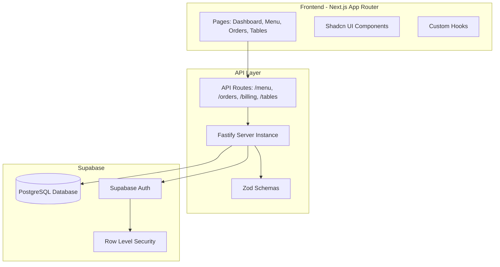

# Restaurant POS System - Implementation Plan

## Overview

This plan scaffolds the complete infrastructure and implements Phase 1 core features for a Restaurant POS system using Next.js App Router, TypeScript, TailwindCSS, Shadcn UI, Fastify (inside Next API routes), and Supabase.

## Architecture Overview



## Phase 1: Project Setup & Infrastructure

### 1.1 Install Dependencies

- **Fastify**: `fastify`, `@fastify/cors`, `@fastify/helmet`
- **Supabase**: `@supabase/supabase-js`, `@supabase/auth-helpers-nextjs`
- **Validation**: `zod`
- **QR Code**: `qrcode`, `@types/qrcode`
- **CSV Export**: `papaparse`, `@types/papaparse`
- **State Management**: `zustand` (optional, for UI state)
- **Date Utilities**: `date-fns`

### 1.2 Environment Variables

Create `.env.local` with:

- `NEXT_PUBLIC_SUPABASE_URL`
- `NEXT_PUBLIC_SUPABASE_ANON_KEY`
- `SUPABASE_SERVICE_ROLE_KEY` (server-side only)

### 1.3 Folder Structure

Create the following structure under `src/`:

```
src/
├── app/
│   ├── (auth)/
│   │   ├── login/
│   │   └── layout.tsx
│   ├── dashboard/
│   ├── menu/
│   ├── orders/
│   ├── tables/
│   ├── api/
│   │   ├── fastify/
│   │   │   └── server.ts
│   │   ├── menu/
│   │   │   └── route.ts
│   │   ├── orders/
│   │   │   └── route.ts
│   │   ├── billing/
│   │   │   └── route.ts
│   │   └── tables/
│   │       └── route.ts
│   └── layout.tsx
├── lib/
│   ├── supabase/
│   │   ├── client.ts (browser client)
│   │   ├── server.ts (server client)
│   │   └── types.ts (generated DB types)
│   ├── fastify.ts
│   ├── auth.ts
│   ├── utils.ts
│   └── types.ts
├── components/
│   ├── ui/ (shadcn components)
│   ├── layout/
│   │   ├── Sidebar.tsx
│   │   ├── Header.tsx
│   │   └── ProtectedRoute.tsx
│   ├── forms/
│   │   ├── MenuItemForm.tsx
│   │   ├── OrderForm.tsx
│   │   └── TableForm.tsx
│   └── tables/
│       ├── MenuTable.tsx
│       └── OrdersTable.tsx
├── hooks/
│   ├── useAuth.ts
│   └── useSupabase.ts
└── store/ (optional Zustand stores)
```

## Phase 2: Core Library Setup

### 2.1 Supabase Configuration

- **File**: `src/lib/supabase/client.ts` - Browser client with auth
- **File**: `src/lib/supabase/server.ts` - Server client for API routes
- **File**: `src/lib/supabase/types.ts` - TypeScript types (initially manual, can be generated later)

### 2.2 Fastify Integration

- **File**: `src/lib/fastify.ts` - Fastify instance factory
- **File**: `src/app/api/fastify/server.ts` - Main Fastify server setup
- Each API route will import and use the Fastify instance

### 2.3 Type Definitions

- **File**: `src/lib/types.ts` - Core TypeScript interfaces:
  - `MenuItem`, `Order`, `OrderItem`, `Table`, `User`, `Outlet`
  - Order status enum: `NEW | PREPARING | READY | SERVED | COMPLETED`
  - Payment method enum: `CASH | UPI | CARD`

### 2.4 Zod Validation Schemas

- Create validation schemas for all API endpoints
- Menu item create/update schemas
- Order create/update schemas
- Table create/update schemas

## Phase 3: Database Schema (Supabase)

### 3.1 Create Tables

Execute SQL migrations in Supabase SQL Editor:

- `users` (extends Supabase auth.users)
- `outlets`
- `items` (menu items)
- `tables`
- `orders`
- `order_items`
- Basic indexes and foreign keys

### 3.2 Row Level Security (RLS)

- Enable RLS on all tables
- Create policies for:
  - Admin: full access
  - Cashier: read/write orders, read menu
  - Staff: read-only access to assigned outlet

## Phase 4: Authentication System

### 4.1 Auth Utilities

- **File**: `src/lib/auth.ts` - Auth helpers (getSession, requireAuth, checkRole)
- **File**: `src/hooks/useAuth.ts` - React hook for auth state

### 4.2 Auth Pages

- **File**: `src/app/(auth)/login/page.tsx` - Login page with Supabase Auth
- **File**: `src/app/(auth)/layout.tsx` - Auth layout wrapper

### 4.3 Protected Routes

- **File**: `src/components/layout/ProtectedRoute.tsx` - HOC for route protection
- Wrap dashboard routes with role-based access

## Phase 5: Shadcn UI Components

Install required Shadcn components:

- `button`, `card`, `table`, `dialog`, `form`, `input`, `select`, `label`, `badge`, `tabs`, `dropdown-menu`, `avatar`, `toast`

## Phase 6: Core Features Implementation

### 6.1 Menu Management

**API Routes** (`src/app/api/menu/route.ts`):

- `GET /api/menu` - List all menu items (with outlet filter)
- `POST /api/menu` - Create menu item
- `PATCH /api/menu/[id]/route.ts` - Update menu item
- `DELETE /api/menu/[id]/route.ts` - Delete menu item

**UI Pages**:

- **File**: `src/app/menu/page.tsx` - Menu management page
- **File**: `src/components/forms/MenuItemForm.tsx` - Add/Edit form
- **File**: `src/components/tables/MenuTable.tsx` - Data table with actions

**Features**:

- CRUD operations
- Category support
- Toggle availability
- Image upload (Supabase Storage)

### 6.2 Order Management

**API Routes** (`src/app/api/orders/route.ts`):

- `POST /api/orders` - Create new order
- `GET /api/orders` - List orders (with filters: status, outlet, date)
- `PATCH /api/orders/[id]/route.ts` - Update order status
- `POST /api/orders/[id]/complete/route.ts` - Complete order

**UI Pages**:

- **File**: `src/app/orders/page.tsx` - Orders dashboard
- **File**: `src/components/forms/OrderForm.tsx` - Create order modal
- **File**: `src/components/tables/OrdersTable.tsx` - Orders list with status badges

**Features**:

- Create dine-in/takeaway orders
- Add items with quantities
- Item-level notes
- Status workflow: NEW → PREPARING → READY → SERVED → COMPLETED
- Cancel orders

### 6.3 Billing & Payments

**API Routes** (`src/app/api/billing/route.ts`):

- `POST /api/billing/generate` - Generate bill for order
- `POST /api/billing/reprint` - Reprint receipt
- `GET /api/billing/[orderId]/route.ts` - Get bill details

**UI Components**:

- **File**: `src/components/billing/BillModal.tsx` - Bill display and payment
- **File**: `src/components/billing/Receipt.tsx` - Receipt component (printable)

**Features**:

- Auto calculate total with tax/GST
- Payment methods: Cash, UPI, Card
- Receipt generation (print/download)
- Reprint support

### 6.4 Table Management

**API Routes** (`src/app/api/tables/route.ts`):

- `GET /api/tables` - List all tables
- `POST /api/tables` - Create table
- `PATCH /api/tables/[id]/route.ts` - Update table (status, assign order)
- `DELETE /api/tables/[id]/route.ts` - Delete table

**UI Pages**:

- **File**: `src/app/tables/page.tsx` - Table layout view
- **File**: `src/components/tables/TableGrid.tsx` - Visual table grid
- **File**: `src/components/forms/TableForm.tsx` - Add/Edit table

**Features**:

- Visual table layout
- Table statuses: Empty / Occupied / Billed
- Assign order to table
- Move tables (drag-drop optional for later)

## Phase 7: Layout & Navigation

### 7.1 Main Layout

- **File**: `src/app/layout.tsx` - Root layout with providers
- **File**: `src/components/layout/Sidebar.tsx` - Navigation sidebar
- **File**: `src/components/layout/Header.tsx` - Top header with user info

### 7.2 Dashboard

- **File**: `src/app/dashboard/page.tsx` - Main dashboard
- Cards: Today's Sales, Orders Count, Top Item
- Placeholder for charts (to be implemented in Phase 3)

## Implementation Order

1. **Setup** (Dependencies, env vars, folder structure)
2. **Core Libraries** (Supabase clients, Fastify, types, Zod schemas)
3. **Database** (Schema creation, RLS policies)
4. **Authentication** (Auth pages, protected routes, hooks)
5. **UI Foundation** (Shadcn components, layout components)
6. **Menu Management** (API + UI)
7. **Table Management** (API + UI)
8. **Order Management** (API + UI)
9. **Billing** (API + UI)
10. **Dashboard** (Basic view with cards)

## Key Files to Create

### Infrastructure

- `src/lib/supabase/client.ts` - Browser Supabase client
- `src/lib/supabase/server.ts` - Server Supabase client
- `src/lib/fastify.ts` - Fastify instance factory
- `src/app/api/fastify/server.ts` - Fastify server setup
- `src/lib/types.ts` - TypeScript interfaces
- `src/lib/auth.ts` - Auth utilities

### API Routes

- `src/app/api/menu/route.ts` - Menu CRUD
- `src/app/api/orders/route.ts` - Order management
- `src/app/api/billing/route.ts` - Billing operations
- `src/app/api/tables/route.ts` - Table management

### UI Components

- `src/app/(auth)/login/page.tsx` - Login page
- `src/app/dashboard/page.tsx` - Dashboard
- `src/app/menu/page.tsx` - Menu management
- `src/app/orders/page.tsx` - Orders view
- `src/app/tables/page.tsx` - Table management
- Layout components (Sidebar, Header, ProtectedRoute)

## Notes

- All API routes use Fastify instance for request handling
- Server components preferred where possible
- Client components only for interactivity (forms, modals)
- Supabase RLS ensures data security at database level
- Zod schemas validate all API inputs
- TypeScript strict mode enabled
- Follow Shadcn UI patterns for consistent styling